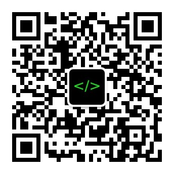

## 建立公众号/播客的起因

去年(2016年6月11日)，我坐在电脑前面，等着凌晨三点的欧洲冠军联赛开始。实在是太困了，我怕睡着以后，错过了比赛，就决定找点儿事情做做，看到别人写公众号挺火的，我决定也搞一个公众号。然后就注册了一个公众号——软件那些事儿——算是正式开始写公众号的生涯。写了好几篇，关注的数量长期徘徊在二十以下，我就把我写的文章，念成语音，放在[网易云音乐](http://music.163.com/#/djradio?id=336387122)和[喜马拉雅电台](http://www.ximalaya.com/46905980/album/4494083)。算是正式开启了我的公众号以及播客的生涯。使用Apple的podcast搜索 **软件那些事儿** 也可以搜索到我这个频道。

## 建立这个blog的起因

截止今天(2017年1月15日)，我已经录了总共85期音频，对应的也有85期的公众号文章发布出来。但是，我感觉把这85期文本存放在腾讯的微信公众号里，说不好哪天就全军覆没了，就在这里给他找一个新家吧。我个人觉得国外的网站，总是要比国内的网站靠谱一些，起码不会被无缘无故的审查并删除文章。我的公众号被删过文章。敝帚自珍吧，毕竟是自己写的85篇文章，以后，我会慢慢的一篇一篇的都复制到这里来，免得被删除。

最后，我的微信公众号是： __软件那些事儿__，可以扫描下面的二维码在微信公众号上关注我。

